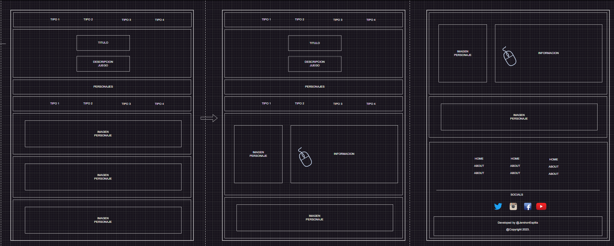
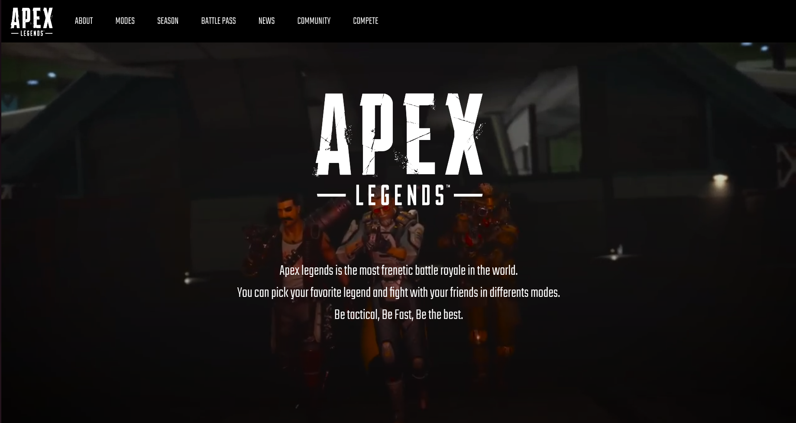
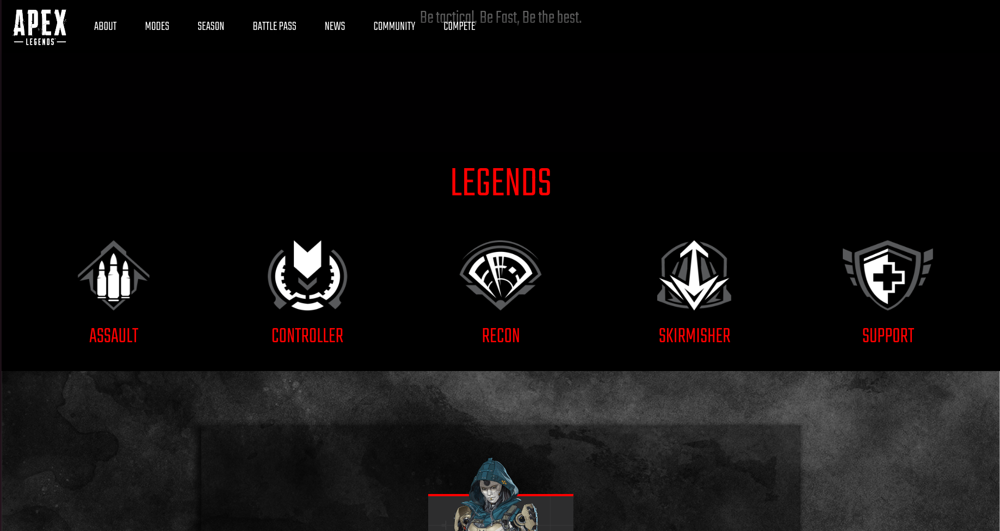
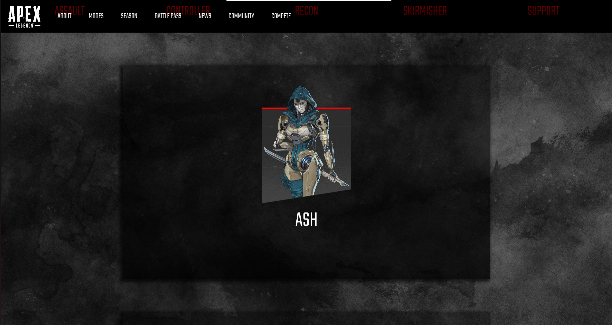
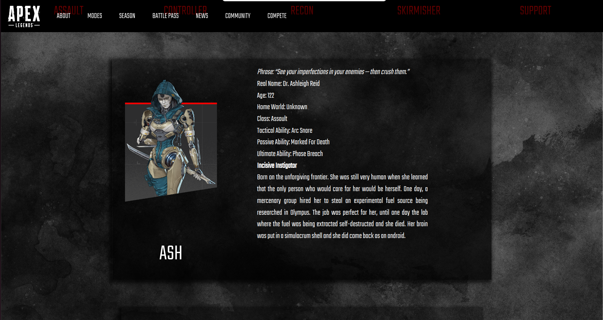
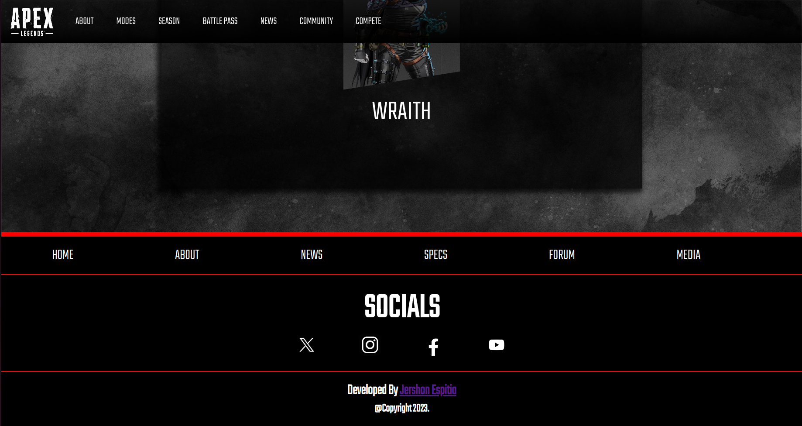

# 
APEX WEB SITE

  

## Index
* About
* Development process
  - Analysis
  - Design
  - Resource collection
  - HTML layout
  - CSS layout
  - Boostrap component implementation
* Screenshots
* How to clone?
* Resources
  - Images
  - Texts
  - Videos
  - Planning
  - HTML
  - CSS3
* Technologies used
* Author
  
## ABOUT
<strong>Apex Web Site</strong> is a class project about the video game Apex Legends developed by [Jershon Espitia](https://github.com/JershonEspitia). 
This web site is inspirated in the [original](https://www.ea.com/es-es/games/apex-legends) page.  
In this Web Site you can found information about the game and some legends with their abilities.

## DEVELOPMENT PROCESS

### Analysis:
The first step for the development of this project was the analysis of what was going to be done, and based on the original website, I took some ideas to implement them in mine.

### Design:
The second step was to create the designs (wireframes) of how I wanted my website to look, these are the mockups.

  

### Resource collection
The third step involved gathering information and translating the texts that were going to be placed on the website, as well as collecting the images.

## SCREENSHOTS

  
  
  
  
  
  

## HOW TO CLONE?

` git clone https://github.com/JershonEspitia/ProjectPageApex `

## RESOURCES
- [Images](Images)
- [Texts](Texts)
- [Videos](Videos)
- [Planning](Planning)
- [HTML](HTML)
- [CSS](CSS)

## TECHNOLOGIES USED
- HTML5
- CSS3
- BOOTSTRAP

## AUTHOR
Developed by [Jershon Espitia](https://github.com/JershonEspitia).
